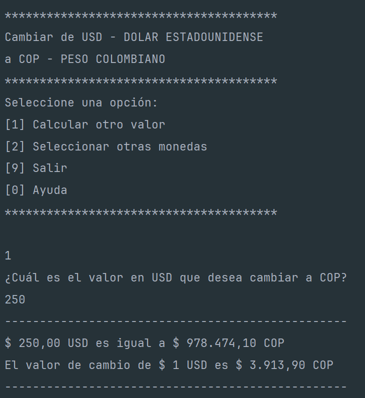

<h1 align="center">Conversor de Monedas Alura ONE</h1>

    
    

        
        
        
        
        
        
        
        
    

<h3>Índice</h3>

- [Descripción del proyecto](#descripción-del-proyecto)

- [Estado del proyecto](#estado-del-proyecto)

- [Características de la aplicación y demostración](#caracteristicas)

- [Tecnologías utilizadas](#tecnologías-utilizadas)

<h2 id="descripción-del-proyecto">Descripción del proyecto</h2>

Este proyecto fue creado como propuesta de solución al challenge Conversor de monedas del programa de formación ONE de Oracle y Alura Latam. El proyecto consiste en una aplicación java que calcula el valor de cambio de dos monedas seleccionadas por el usuario, a partir de la consulta a una API que suministra las tasas de cambio de diferentes monedas del mundo.

<h2 id="estado-del-proyecto">Estado del proyecto</h2>

La primera versión del proyecto se encuentra terminada y permite realizar el cálculo de cambio de monedas, así como obtener algunos datos adicionales.

<h2 id="caracteristicas">Características de la aplicación y demostración</h2>

- `Pantalla inicial`: Da la bienvenida al usuario solicitando ingresar los códigos de monedas que desea cambiar, además de un ejemplo de algunas.

- `Configuración inicial` : Se le solicita al usuario ingresar una moneda para tomar como referencia, y una segunda a la cuál desea convertir un valor. Esto aplica una configuración inicial a la aplicación y retorna el cálculo correspondiente.

- `Menú de opciones` : Luego de realizar el primer cálculo, el usuario tiene las siguientes opciones:
  1. Calcular otro valor con referencia a las monedas que ya están configuradas en la aplicación. En la parte superior, la aplicación muestra las monedas que se encuentran seleccionadas actualmente y el nombre de la divisa que permite identificar el código de moneda.
  2. Seleccionar otras monedas. Si el usuario lo requiere puede cambiar la configuración y seleccionar otras monedas.
  3. Salir, cierra la aplicación.
  4. Ayuda, le da información adicional que le permite entender mejor el uso de la aplicación.

- `[1] Calcular otro valor` : Solo requiere ingresar un valor, y se procede con las monedas ya configuradas.

- `[2] Seleccionar otras monedas` : Se solicita nuevamente la moneda de referencia y la moneda a la que se desea realizar el cambio (conversión). Luego se pregunta el valor que desea convertir y se actualiza la configuración de la aplicación.

- `[9] Salir` : Muestra un mensaje de cierre y termina la ejecución de la aplicación.
  

- `[0] Ayuda` : Muestra un texto de ayuda y regresa al menú.
  

<h2 id="tecnologías-utilizadas">Tecnologías utilizadas</h2>

La aplicación fue desarrollada usando JAVA, implementando clases, objetos, interfaces y API.
